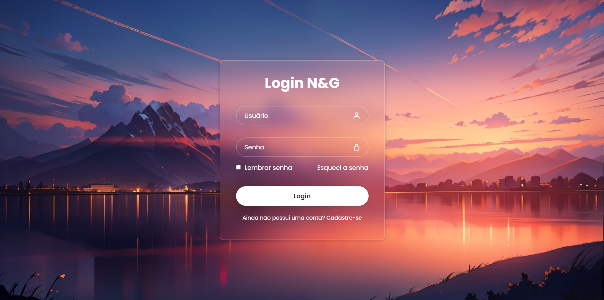

# 🔐 Projeto Tela de Login — HTML e CSS

Bem-vindo(a) ao repositório do **Projeto Tela de Login**, um exercício de criação de interface utilizando **HTML5** e **CSS3**, com foco em boas práticas de layout, responsividade e design visual agradável.

---

## 🚀 Sobre o projeto

A Tela de Login é o primeiro contato de muitos usuários com uma aplicação. Este projeto foi desenvolvido para treinar:

- Estruturação semântica com HTML5
- Estilização moderna e responsiva com CSS3
- Organização de projeto front-end
- Design clean e minimalista, com atenção à usabilidade

A proposta é simular uma página de login que poderia ser usada em sites reais, como sistemas internos, redes sociais ou e-commerce.

---

## 🎨 Paleta de Cores

Função             | Cor        | Código HEX | 
Cor dos icones     | Branco     | `#fff`     | 
Cor do botão Login | Branco     | `#fff`     | 
Cor dos Textos     | Branco     | `#fff`     |
Cor do texto Login | Cinza      | `#333`     |
Fundo              | IMAGEM     |

> As cores foram escolhidas para transmitir confiança, modernidade e simplicidade.

---

## 🖼️ Imagens e Design

O projeto utiliza alguns elementos visuais para reforçar a identidade da tela:

- **Logo**: Uma imagem pequena no topo da tela (`assets/logo.png`).
- **Background opcional**: Uma imagem de fundo suave (`assets/background.jpg`) ou uma cor sólida de fundo.
- **Ícones**: Pequenos ícones de usuário e senha podem ser adicionados nos campos de entrada.

---

## 🛠️ Tecnologias utilizadas

- **HTML5** — Estrutura do conteúdo
- **CSS3** — Estilização, layout responsivo, animações leves

---

## 📂 Estrutura do projeto
tela-de-login/  
├── index.html         # Arquivo principal com o código HTML  
├── style.css          # Estilização da página  
├── assets/            # Pasta para imagens, ícones ou fontes  
│   |      
│   └── background.jpg # (opcional) Imagem de fundo  
└── README.md          # Documentação do projeto

## 📸 Prévia do Projeto

(https://natieledpaula.github.io/Projeto-Tela-de-Login-com-HTML-e-CSS/)

---

## ✨ Funcionalidades

- Formulário com campos de e-mail e senha
- Botão de "Entrar"
- Layout centralizado e responsivo
- Feedback visual nos campos de entrada (hover e focus)

---

## 🧠 Aprendizados
- Posicionamento com Flexbox
- Criação de formulários estilizados
- Uso de placeholders, labels e botões personalizados
- Responsividade para diferentes dispositivos

---

## 📸 Captura de Tela

